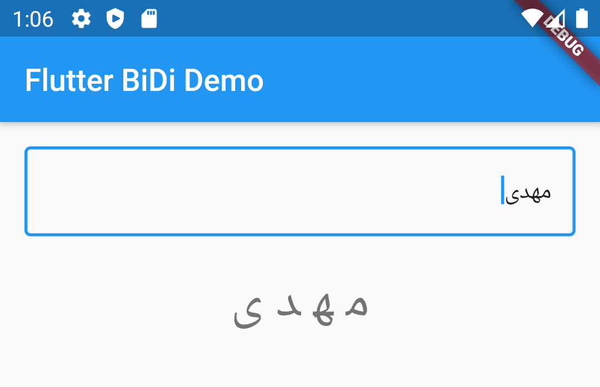

# bidi
[](https://pub.dartlang.org/packages/bidi)

Implementation of the Bidi algorithm, as described in http://www.unicode.org/reports/tr9/tr9-17.html.

Converts *logical* strings to their equivalent *visual* representation. Persian, Hebrew and Arabic languages (and any other RTL language) are supported.




## Getting Started
In your `pubspec.yaml` file add:

```dart
dependencies:
  bidi: any
```
Then, in your code import and use the package:
```dart
import 'package:bidi/bidi.dart' as bidi;

final visual = bidi.logicalToVisual('نوشته پارسی اینجا گذارده شود.');
print(visual);
```